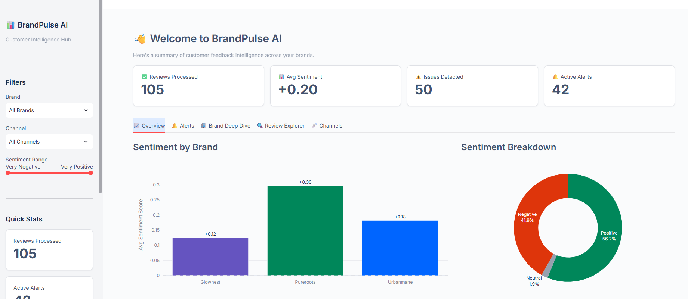
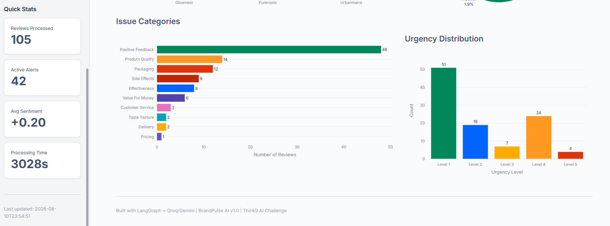
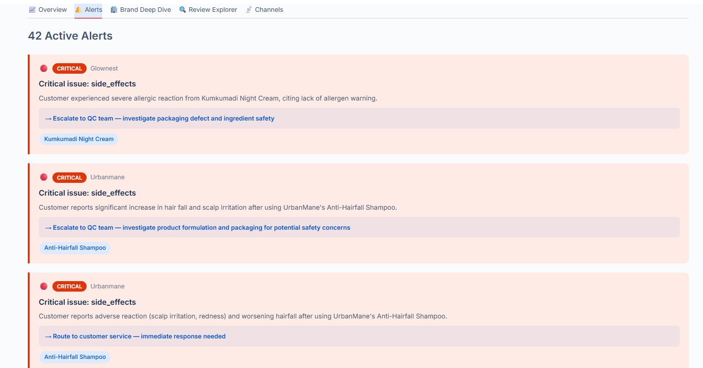
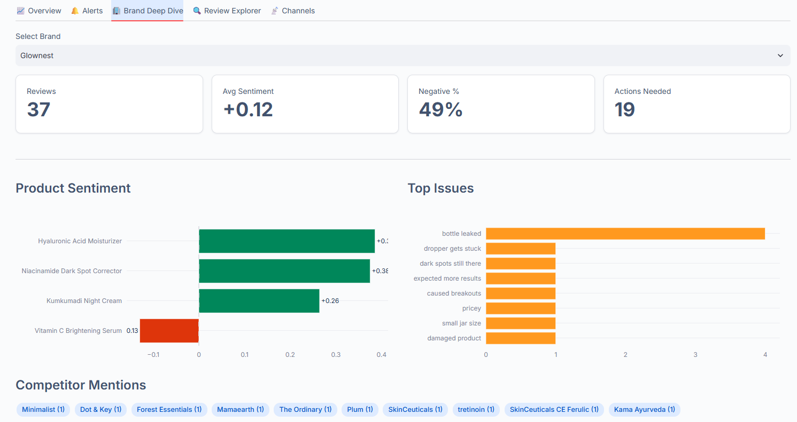

# 🧠 BrandPulse AI

> **Autonomous Customer Feedback Intelligence for Multi-Brand Portfolios**

[](https://python.org)
[](https://langchain-ai.github.io/langgraph/)
[](https://groq.com/)
[](https://ai.google.dev/)
[](https://streamlit.io)

---

## 📑 Table of Contents

- [📋 Problem Statement](#-problem-statement)
- [🏗️ System Architecture](#️-system-architecture)
  - [Agent Roles](#agent-roles)
- [🚀 Quick Start](#-quick-start)
  - [Prerequisites](#prerequisites)
  - [Setup](#setup)
  - [Run the Pipeline](#run-the-pipeline)
  - [Launch the Dashboard](#launch-the-dashboard)
- [📸 Demo](#-demo)
- [📁 Project Structure](#-project-structure)
- [🎯 Key Features](#-key-features)
  - [🤖 Multi-Agent Pipeline (LangGraph)](#-multi-agent-pipeline-langgraph)
  - [🔍 Anomaly Detection](#-anomaly-detection)
  - [📊 Interactive Dashboard](#-interactive-dashboard)
  - [🌐 Multi-Brand Intelligence](#-multi-brand-intelligence)
- [📊 Sample Data & Embedded Anomalies](#-sample-data--embedded-anomalies)
- [🛠️ Tech Stack](#️-tech-stack)

---

## 📋 Problem Statement

When operating **30+ consumer brands** simultaneously, customer feedback is:

- **Scattered** — across Amazon, Flipkart, Instagram, support tickets, and app stores
- **Unstructured** — free-text reviews, Hinglish comments, complaint emails, social posts
- **Delayed** — teams discover quality issues **weeks** after they become systemic
- **Siloed** — Brand A's packaging fix could prevent Brand B's same mistake, but knowledge never crosses

**BrandPulse AI** solves this by deploying an **autonomous agentic pipeline** that continuously ingests, classifies, and analyzes customer feedback across all brands — surfacing actionable intelligence and cross-brand patterns in real-time.

---

## 🏗️ System Architecture

```
┌────────────────────────────────────────────────────────────────────┐
│                       DATA INGESTION LAYER                          │
│   Amazon │ Flipkart │ Instagram │ Support Tickets │ App Store       │
└─────────────────────────────┬──────────────────────────────────────┘
                              │
                              ▼
┌────────────────────────────────────────────────────────────────────┐
│                    LANGGRAPH AGENTIC PIPELINE                       │
│                                                                     │
│   ┌─────────────┐  ┌─────────────┐  ┌──────────────────┐          │
│   │ Classifier   │  │ Sentiment    │  │ Entity Extractor  │          │
│   │ Agent        │  │ Agent        │  │ Agent             │          │
│   │              │  │              │  │                   │          │
│   │ • Category   │  │ • Score      │  │ • Products        │          │
│   │ • Urgency    │  │ • Emotions   │  │ • Competitors     │          │
│   │ • Action     │  │ • Phrases    │  │ • Ingredients     │          │
│   └──────┬───────┘  └──────┬───────┘  └─────────┬────────┘          │
│          └─────────────────┴─────────────────────┘                  │
│                             │                                       │
│                    ┌────────▼─────────┐                             │
│                    │   Orchestrator    │                             │
│                    │   Agent           │                             │
│                    │                   │                             │
│                    │ • Synthesis       │                             │
│                    │ • Cross-brand     │                             │
│                    │ • Alert decision  │                             │
│                    └────────┬─────────┘                             │
└─────────────────────────────┼──────────────────────────────────────┘
                              │
                              ▼
┌────────────────────────────────────────────────────────────────────┐
│                   INTELLIGENCE & ACTION LAYER                       │
│                                                                     │
│   🔔 Alert Engine    📊 Dashboard    🔍 Anomaly Detection          │
│   • Severity-based   • Auto-routing     • Issue spikes                │
│   • Auto-routing     • Per-brand     • Sentiment drops             │
│   • Slack/Email      • Interactive   • Cross-brand patterns        │
└────────────────────────────────────────────────────────────────────┘
```

### Agent Roles

| Agent | Model | Purpose |
|-------|-------|---------|
| **Classifier** | Gemini 2.0 Flash | Categorizes feedback into 11 issue types with 1-5 urgency |
| **Sentiment Analyzer** | Gemini 2.0 Flash | Scores sentiment (-1 to +1), detects emotions, extracts key phrases |
| **Entity Extractor** | Gemini 2.0 Flash | Identifies brands, products, competitors, ingredients, issues |
| **Orchestrator** | Gemini 2.0 Flash | Synthesizes all signals, decides actions, detects cross-brand relevance |

---

## 🚀 Quick Start

### Prerequisites

- Python 3.11+
- Groq API key ([get one free](https://console.groq.com/keys)) — **recommended**
- Or Google Gemini API key ([get one here](https://aistudio.google.com/apikey))

### Setup

```bash
# 1. Clone the repository
git clone https://github.com/Aaryav1130/BrandPulse-AI
cd brandpulse-ai

# 2. Create virtual environment
python -m venv .venv
.venv\Scripts\activate

# 3. Install dependencies
pip install -r requirements.txt

# 4. Configure environment
cp .env.example .env
# Edit .env: set LLM_PROVIDER=groq and add your GROQ_API_KEY
# Or set LLM_PROVIDER=gemini and add your GOOGLE_API_KEY
```

### Run the Pipeline

```bash
# Process all 105 sample reviews
python main.py

# Process a specific brand
python main.py --brand glownest

# Process limited reviews (for quick testing)
python main.py --limit 10

# Verbose mode
python main.py --brand urbanmane --limit 5 --verbose
```

### Launch the Dashboard

```bash
streamlit run dashboard/app.py
```

---

## 📸 Demo









---

## 📁 Project Structure

```
brandpulse-ai/
├── main.py                        # CLI entry point
├── requirements.txt               # Python dependencies
├── .env.example                   # Environment config template
├── Dockerfile                     # Container deployment
│
├── config/
│   └── brands.yaml                # Multi-brand configuration
│
├── data/
│   └── sample_reviews.json        # 105 realistic reviews (3 brands)
│
├── src/
│   ├── agents/
│   │   ├── classifier.py          # Issue classification agent
│   │   ├── sentiment.py           # Sentiment analysis agent
│   │   ├── entity_extractor.py    # Entity extraction agent
│   │   └── orchestrator.py        # Orchestrator / brain agent
│   │
│   ├── graph/
│   │   └── pipeline.py            # LangGraph StateGraph pipeline
│   │
│   ├── ingestion/
│   │   └── loader.py              # Data loading & normalization
│   │
│   ├── alerts/
│   │   └── notifier.py            # Alert detection & notification
│   │
│   ├── models/
│   │   └── schemas.py             # Pydantic models & graph state
│   │
│   └── utils/
│       └── helpers.py             # Shared utilities
│
├── dashboard/
│   └── app.py                     # Streamlit analytics dashboard
│
├── tests/
│   └── test_pipeline.py           # Pipeline tests
│
└── docs/
    └── architecture.md            # Detailed system design
```

---

## 🎯 Key Features

### 🤖 Multi-Agent Pipeline (LangGraph)
- **Fan-out/fan-in** architecture: Classifier, Sentiment, and Entity agents run in parallel
- **Orchestrator** synthesizes all signals into actionable intelligence
- Automatic retry with exponential backoff on LLM failures

### 🔍 Anomaly Detection
- **Issue spikes**: Detects unusual concentration of complaints (e.g., 8 packaging complaints for one product)
- **Sentiment drops**: Alerts when a brand's average sentiment falls below threshold
- **Cross-brand patterns**: Identifies issues that appear across multiple brands simultaneously

### 📊 Interactive Dashboard
- Dark-themed, production-quality Streamlit UI
- 6 analytical views: Overview, Alerts, Brand Deep Dive, Review Explorer, Channels, Trends
- Real-time filtering by brand, channel, and sentiment range

### 🌐 Multi-Brand Intelligence
- Config-driven brand onboarding via YAML
- Cross-brand relevance detection ("this packaging issue may affect PureRoots too")
- Portfolio-level health metrics

---

## 📊 Sample Data & Embedded Anomalies

The project includes **105 realistic customer reviews** with two embedded anomalies for demonstration:

| Anomaly | Brand | Issue | Count | Expected Detection |
|---------|-------|-------|-------|-------------------|
| **Packaging Spike** | GlowNest | Vitamin C Serum bottle leaking/cracking | 8 reviews | Issue spike alert + cross-brand packaging warning |
| **Hairfall Cluster** | UrbanMane | Anti-Hairfall Shampoo increasing hairfall | 5 reviews | Side effects alert + high urgency flagging |

---

## 🛠️ Tech Stack

| Component | Technology | Why |
|-----------|-----------|-----|
| Agent Orchestration | **LangGraph** | Production-grade stateful agent graphs with fan-out/fan-in |
| LLM | **Google Gemini 2.0 Flash** | Fast, cost-effective, strong JSON output |
| Data Models | **Pydantic v2** | Runtime validation with rich type hints |
| Dashboard | **Streamlit + Plotly** | Rapid interactive visualization |
| Config | **YAML** | Human-readable multi-brand configuration |
| Logging | **Rich** | Beautiful console output with tracebacks |
| Resilience | **Tenacity** | Automatic retry with exponential backoff |
